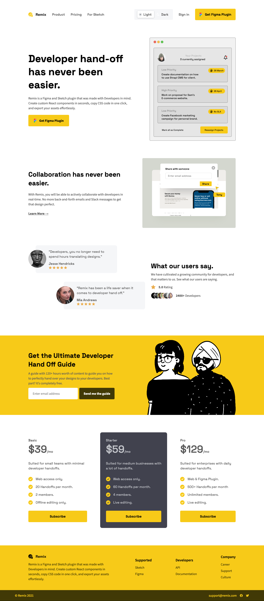
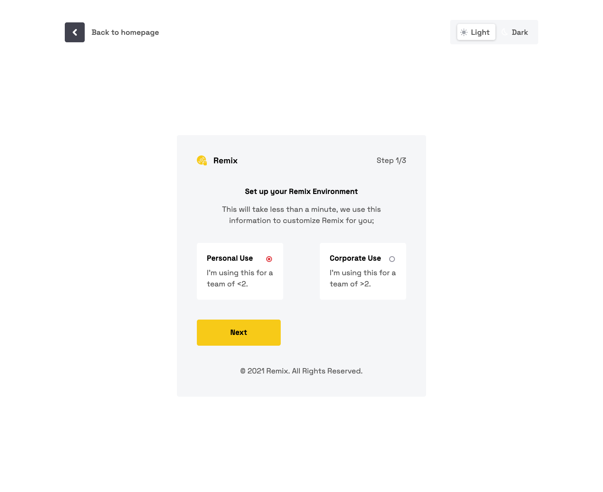
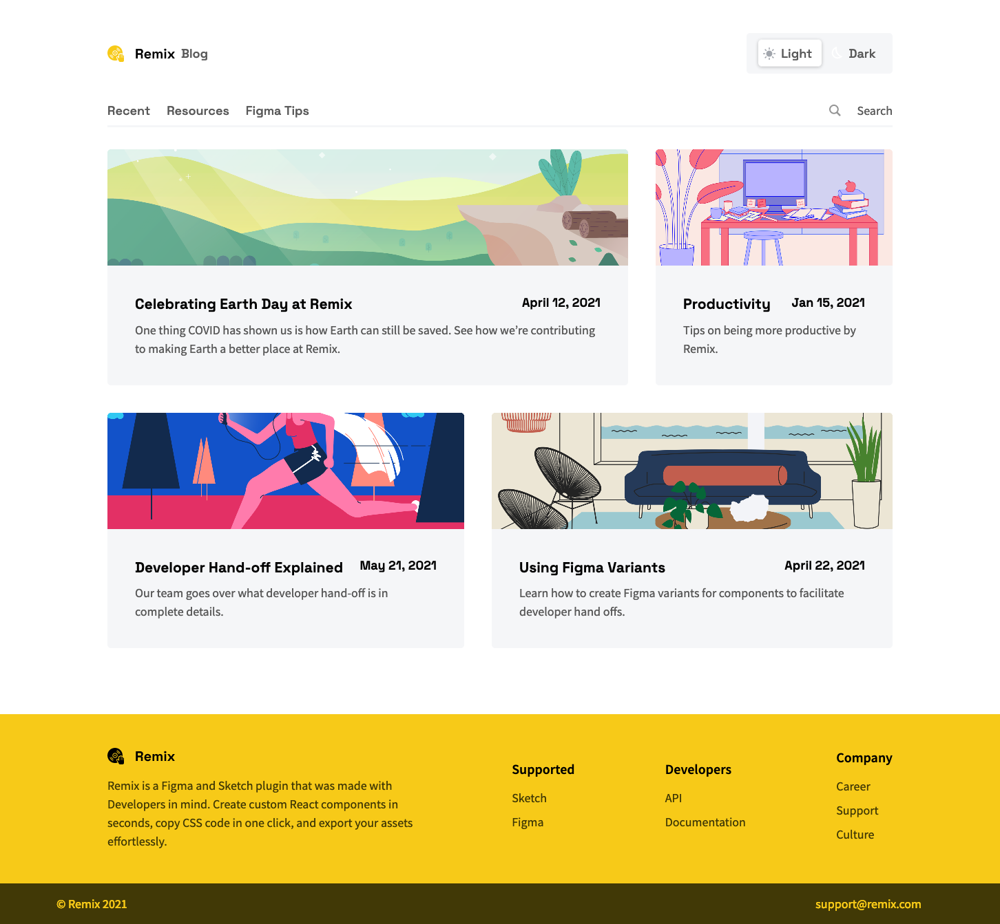

# Codewell - Remix 

This is a solution to the [Remix Template](https://www.codewell.cc/challenges/remix-template--609f74e13167fa10b79b7b9b). Codewell challenges help you Improve your HTML and CSS skills by practicing on real design templates.

## Table of contents

- [Overview](#overview)
  - [Demo](#demo)
  - [Screenshot](#screenshot)
  - [Links](#links)
  - [Built with](#built-with)

## Overview

### Demo

### Screenshot

### Links

- Live Site URL: [Preview](https://s-vaitla1.github.io/remixFE/)

### Built with

- Semantic HTML5 markup
- CSS custom properties
- Flexbox
- SCSS
